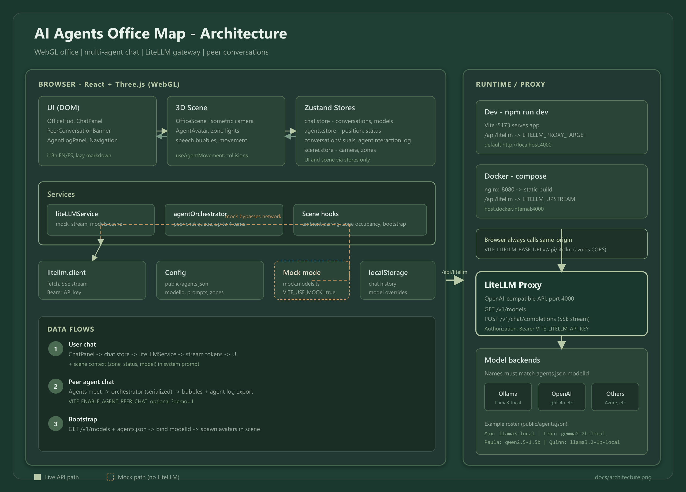

# 🏢 AI Agents Office Map (WebGL)
> **Idiomas:** [English](README.md) · Español (este archivo) — al actualizar el README, mantener ambos archivos alineados.

Diorama isométrico de oficina renderizado con **WebGL**. Los agentes de IA aparecen como avatares, se mueven por la oficina y abren un chat con LiteLLM al seleccionarlos. La app puede correr completa en modo mock o conectarse a un proxy LiteLLM compatible con OpenAI.

## 🎬 Demo


**Flujo ~75 s:** pan del mapa → chat con un agente → enviar `ve a tomar cafe` → **banner + burbujas** de charla peer → abrir **Ver log** → luces de zona según avatares → cambiar de zona.

Usá `http://localhost:5173/?demo=1` para charlas peer más rápidas al grabar. Ver [docs/DEMO_RECORDING.es.md](docs/DEMO_RECORDING.es.md) (o [EN](docs/DEMO_RECORDING.md)) para regenerar el GIF y copiar borradores para LinkedIn.

## ✨ Qué Incluye
- **Oficina 3D interactiva:** React Three Fiber + Drei, cámara isométrica, zonas, mobiliario, avatares y detalles de ambiente.
- **Chat por agente:** una conversación persistida por agente, respuestas markdown, streaming, botón **Stop** mientras genera, y cambio de modelo desde el panel.
- **Charlas entre agentes:** agentes idle cercanos se emparejan por proximidad y conversan vía LLM (turnos alternados); un **banner** superior y burbujas muestran texto en vivo en la escena.
- **Iluminación por ocupación de zona:** las luces de área suben cuando hay avatares en una zona.
- **Log de interacciones:** panel en vivo en el HUD más exportación descargable `.txt` de mensajes agente-a-agente.
- **Integración LiteLLM:** modo mock por defecto; modo live vía proxy `/api/litellm` hacia `/v1/models` y `/v1/chat/completions`.
- **Agentes configurables:** nombres, roles, modelos, zonas, prompts, colores y diseños de avatar en `public/agents.json`.
- **UI bilingüe:** interfaz, roles y prompts en inglés y español.
- **Comandos de escena:** instrucciones en el chat pueden mover agentes por la oficina.
- **Runtime con Docker:** build de Vite servido por nginx sin privilegios con proxy `/api/litellm`.

## 🛠️ Stack
- **React 19 + TypeScript + Vite**
- **Three.js** vía **React Three Fiber** + **Drei** + **postprocessing**
- **Zustand** para estado de escena, agentes y chat
- **react-markdown** + **remark-gfm** para render del chat
- **LiteLLM** como gateway de modelos compatible con OpenAI
- **nginx** para la imagen Docker de producción
- **Playwright** + **ffmpeg-static** (script planificado para captura del GIF demo)

## 📋 Requisitos
- **Node.js 22+** recomendado
- **npm** (usa `package-lock.json`)
- **Docker + Docker Compose** si querés correr el runtime containerizado
- Opcional: un proxy **LiteLLM** corriendo para llamadas live — ver [LiteLLM.Local](https://github.com/agustinafassina/LiteLLM.Local) para un setup local gratis (modelos Ollama, sin costo de APIs en la nube)

## 🚀 Inicio Rápido
Corrida local en modo mock, sin backend:

```bash
npm install
npm run dev
```

Abrí `http://localhost:5173`.

Scripts útiles:

```bash
npm run dev       # Servidor dev de Vite
npm run build     # TypeScript check + build de producción
npm run preview   # Preview del build
npm run lint      # ESLint
npm run demo:gif  # Regenerar docs/demo.gif (requiere scripts/capture-demo-gif.mjs)
```

## ⚙️ Variables De Entorno
Copiá `.env.example` a `.env` para desarrollo local:

```bash
cp .env.example .env
```

En Windows PowerShell, también podés usar `Copy-Item .env.example .env`.

Variables principales:

- `VITE_USE_MOCK_LITELLM`: `true` usa modelos y respuestas mock incluidos. Setear `false` para LiteLLM live.
- `VITE_LITELLM_BASE_URL`: URL base de LiteLLM visible desde el browser. Dejá `/api/litellm` en dev local y Docker para que Vite/nginx hagan proxy.
- `VITE_LITELLM_API_KEY`: bearer token compatible con OpenAI usado por el cliente frontend.
- `VITE_AGENTS_CONFIG_URL`: URL opcional para el roster de agentes. Default: `/agents.json`.
- `VITE_ENABLE_AGENT_PEER_CHAT`: `true` (default) ejecuta charlas LLM cuando se emparejan agentes en la escena; `false` deja solo la animación ambiental.
- `LITELLM_PROXY_TARGET`: **solo dev** — upstream del proxy Vite para `/api/litellm`. Default: `http://localhost:4000`. No se embebe en el bundle del browser.
- `OFFICE_MAP_PORT`: puerto host para Docker. Default: `3000`.
- `LITELLM_UPSTREAM`: **solo Docker** — upstream de nginx para `/api/litellm`. Default: `http://host.docker.internal:4000`.

Importante: las variables `VITE_*` se embeben en el bundle del navegador durante el build. Si las cambiás, reiniciá Vite o reconstruí la imagen Docker. Evitá usar secretos productivos en `VITE_LITELLM_API_KEY`; para producción conviene aplicar autenticación en el proxy/backend.

## 🤖 Modos LiteLLM
### Modo Mock
El modo mock viene por defecto:

```env
VITE_USE_MOCK_LITELLM=true
VITE_LITELLM_BASE_URL=/api/litellm
VITE_LITELLM_API_KEY=
```

Sirve para trabajar UI, escena y demos sin servidor de modelos.

### Modo Live
Para inferencia live, corré un proxy LiteLLM en el host (puerto default `4000`). Este proyecto está pensado para usarse con **[LiteLLM.Local](https://github.com/agustinafassina/LiteLLM.Local)** — un stack Docker que expone una API compatible con OpenAI y enruta a **modelos Ollama gratis** en tu máquina (sin keys de pago en la nube).

1. Cloná y levantá [LiteLLM.Local](https://github.com/agustinafassina/LiteLLM.Local) (`docker compose up -d` con Ollama en `:11434`).
2. Hacé pull de los backends Ollama listados en ese repo (ej. `phi3:mini`, `llama3.2:1b`, `qwen2.5:1.5b`, `gemma2:2b`).
3. Configurá esta app:

```env
VITE_USE_MOCK_LITELLM=false
VITE_LITELLM_BASE_URL=/api/litellm
VITE_LITELLM_API_KEY=sk-1234
```

Los `modelId` default en `public/agents.json` coinciden con los nombres de API de LiteLLM.Local (`llama3-local`, `gemma2-2b-local`, `qwen2.5-1.5b-local`, `llama3.2-1b-local`).

En desarrollo local, Vite proxyea `/api/litellm` a `LITELLM_PROXY_TARGET` (default `http://localhost:4000`) desde `vite.config.ts`. **No** apuntes `VITE_LITELLM_BASE_URL` a `:4000` directo — el browser chocaría con CORS.

## 🐳 Docker
Construir y correr la imagen de producción:

```bash
docker compose up --build
```

Abrí `http://localhost:3000`.

El modo mock es el default, así que Docker funciona sin LiteLLM. Para usar LiteLLM live corriendo en el host:

```bash
VITE_USE_MOCK_LITELLM=false VITE_LITELLM_API_KEY=sk-tu-key docker compose up --build
```

También podés poner esos valores en `.env`; Docker Compose lo lee automáticamente.

Cambiar el puerto expuesto:

```bash
OFFICE_MAP_PORT=8080 docker compose up --build
```

Cambiar el upstream de LiteLLM usado por nginx:

```bash
LITELLM_UPSTREAM=http://host.docker.internal:4000 docker compose up --build
```

Notas de Docker:

- La imagen final sirve estáticos con `nginxinc/nginx-unprivileged`.
- El puerto interno del contenedor es `8080`; Compose lo mapea a `OFFICE_MAP_PORT`.
- nginx proxyea `/api/litellm` a `LITELLM_UPSTREAM` y desactiva buffering para streaming.
- Los valores `VITE_*` son build args, por lo que cambiarlos requiere `docker compose up --build`.

## 👥 Agentes, Roles Y Modelos
El roster default está en `public/agents.json`. Cada agente vincula un personaje visible de la oficina con un modelo y un system prompt específico por rol.

Agentes default:

- `backend-agent` — **Max**, Backend, `llama3-local`, escritorio central, avatar inspirado en Bob Marley.
- `ux-agent` — **Lena**, UI/UX, `gemma2-2b-local`, living, avatar inspirado en Shakira.
- `po-agent` — **Paula**, Product Owner, `qwen2.5-1.5b-local`, escritorios de pared, avatar inspirado en Freddie Mercury.
- `qa-agent` — **Quinn**, QA, `llama3.2-1b-local`, escritorios de pared, avatar inspirado en Michael Jackson.

Campos requeridos por agente:

- `id`: identificador estable usado para historial de chat y runtime.
- `name`: nombre visible.
- `role`: objeto localizado, por ejemplo `{ "en": "Backend", "es": "Backend" }`.
- `modelId`: id del modelo esperado desde LiteLLM `/v1/models`.
- `logoUrl`: path público para el logo en HUD/chat.
- `avatarColor` y `accentColor`: colores visuales.
- `homeZone`: una de `center-desk`, `living`, `cafeteria`, `wall-desks`.
- `systemPrompt`: objeto localizado usado como system prompt del modelo.

Campos opcionales:

- `avatarDesignId`: uno de `bob-marley`, `shakira`, `freddie-mercury`, `michael-jackson`.
- `wallDeskSlot`: `0`, `1` o `2`, solo para agentes en `wall-desks`.

Para usar un roster custom, editá `public/agents.json` o apuntá `VITE_AGENTS_CONFIG_URL` a otro JSON con la misma forma.

## 💬 Comandos De Escena
Escribí estos comandos en el chat de un agente para controlar el avatar:

- `ve a tomar cafe`: camina a la cola de la cafetería.
- `relajate`: se mueve al living/zona de descanso.
- `vuelve al escritorio`: vuelve al escritorio del agente.
- `ve al hub`: se mueve al hub central.

El parsing de comandos vive en `src/utils/chatAgentCommands.ts`; el movimiento se despacha desde `agents.store`.

## 🤝 Charlas Entre Agentes (Peer)
Cuando dos agentes idle están **cerca en la escena** (emparejamiento por proximidad, cualquier zona), la app puede iniciar una charla ambiental:

1. `useAmbientAgentConversations` empareja agentes elegibles y abre el vínculo visual (funciona aunque el panel de chat esté abierto — solo excluye al agente activo).
2. `agentOrchestrator.service` ejecuta hasta cuatro turnos LLM alternados (cola serializada); hace fallback a líneas mock si falla una llamada live.
3. Cada turno llama a `liteLLMService` con prompts por rol e historial compartido.
4. `conversationVisuals.store` maneja el banner superior y las burbujas; `agentInteractionLog.store` registra cada turno.

Acciones en el HUD:

- **Ver log** — panel deslizable con sesiones y turnos en vivo.
- **Descargar** — exporta `office-agent-log-*.txt`.

Activá o desactivá charlas peer con `VITE_ENABLE_AGENT_PEER_CHAT`. Agregá `?demo=1` a la URL para emparejar más rápido al grabar demos.

## 📁 Estructura Del Proyecto
```text
public/
  agents.json           # Roster default, roles y prompts
  logos/                # Iconos por rol/agente
  textures/             # Overrides opcionales de texturas PNG
src/
  app/                  # Shell raíz de la app
  components/scene/     # Oficina WebGL, mobiliario, avatares, cámara
  components/ui/        # HUD, panel de chat y UI no-WebGL
  config/               # Agentes, zonas, tamaños de modelo, diseños de avatar
  hooks/                # Hooks de UI/escena
  i18n/                 # Traducciones EN/ES y helpers localizados
  services/
    litellm/            # Cliente LiteLLM + capa de servicio
    agentOrchestrator.service.ts  # Cola de turnos peer
  stores/
    agentInteractionLog.store.ts  # Log peer + export TXT
    conversationVisuals.store.ts  # Burbujas peer + chat usuario
  types/                # Tipos TypeScript compartidos
  utils/                # Movimiento, colisiones, persistencia, comandos de chat
docker/
  nginx/                # Template nginx de producción
docs/
  demo.gif              # Animación demo del README
  architecture.png      # Diagrama de arquitectura de alto nivel
  DEMO_RECORDING.md     # How to record / regenerate the GIF + LinkedIn drafts (EN)
  DEMO_RECORDING.es.md  # Cómo grabar / regenerar el GIF + LinkedIn (ES)
```

## 🔧 Cambios Comunes
- Agregar o editar agentes: `public/agents.json`
- Cambiar diseños de avatar musicales: `src/config/avatarDesigns.ts`
- Cambiar roles o prompts: `public/agents.json`
- Agregar comandos de chat: `src/utils/chatAgentCommands.ts` y `src/stores/chat.store.ts`
- Ajustar timing de charlas peer: `src/hooks/useAmbientAgentConversations.ts` y `src/services/agentOrchestrator.service.ts`
- Cambiar UI del log: `src/components/ui/AgentLogPanel.tsx`
- Cambiar banner peer o luces de zona: `src/components/ui/PeerConversationBanner.tsx`, `src/components/scene/OfficeZoneLights.tsx`
- Agregar mobiliario o ambientes: `src/components/scene/furniture/`
- Ajustar movimiento/colisiones: `src/utils/collision.ts`, `src/config/officeObstacles.ts`, `src/stores/agents.store.ts`
- Cambiar traducciones: `src/i18n/locales/en.json` y `src/i18n/locales/es.json`
- Cambiar proxy Docker: `docker/nginx/default.conf.template`

## 🏗️ Arquitectura



- **Escena y UI separadas:** los componentes WebGL no importan la UI del chat; los stores conectan acciones de escena con estado de UI.
- **LiteLLM aislado:** el código de app debería llamar a `liteLLMService`, no a `fetch` directo.
- **Config vs runtime:** las definiciones de agentes vienen de JSON/API; posición y estado runtime viven en `agents.store`.
- **Hilos por agente:** el historial de chat se indexa por `agentId` y se persiste en `localStorage`.
- **Contexto de escena:** cada mensaje del usuario incluye contexto actual de agente/escena desde `buildAgentSceneContext`.
- **Orquestación peer:** una charla peer a la vez vía cola; los turnos se acumulan en un log en memoria (exportable, no persiste al recargar).

## 🔍 Troubleshooting
- **Errores de LiteLLM / CORS en el browser:** dejá `VITE_LITELLM_BASE_URL=/api/litellm` y corré LiteLLM en el host; en dev usá `LITELLM_PROXY_TARGET=http://localhost:4000`.
- **Docker abre pero no carga modelos live:** revisá `VITE_USE_MOCK_LITELLM=false`, reconstruí la imagen y verificá `LITELLM_UPSTREAM`.
- **Cambiaste `.env` y no pasa nada:** reiniciá Vite o reconstruí Docker porque `VITE_*` son valores de build.
- **Un modelo aparece como no disponible:** asegurate de que `modelId` en `public/agents.json` coincida exactamente con un id de LiteLLM `/v1/models`.
- **El streaming va lento o se corta:** revisá logs del proxy LiteLLM y la URL upstream; nginx en Docker desactiva buffering para `/api/litellm`.
- **El log de interacciones queda vacío:** dejá la escena ~15 s, probá `?demo=1`, confirmá `VITE_ENABLE_AGENT_PEER_CHAT=true`, y verificá que LiteLLM responda (el fallback mock igual registra turnos si falla live).

## 📄 Licencia
Por **Agustina Fassina**
