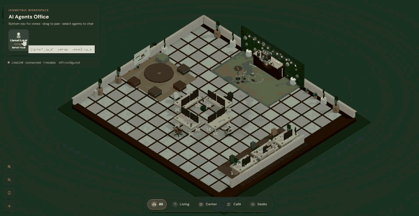

# 🏢 AI Agents Office Map (WebGL)
> **Idiomas:** [English](README.md) · Español (este archivo) — al actualizar el README, mantener ambos archivos alineados.

Diorama isométrico de oficina renderizado con **WebGL** (Three.js + React Three Fiber). Los agentes de IA aparecen como avatares, caminan de forma autónoma y abren un chat con LiteLLM al seleccionarlos.

## 🎬 Demo


**Flujo ~30 s:** pan del mapa → click en agente → mensaje en el chat → `ve a tomar cafe` → el avatar camina a la cafetería.

## ✨ Funcionalidades
- **LiteLLM** — agentes desde `/v1/models`, o modo mock sin backend
- **Chat por agente** — historial en sidebar; zoom del mapa al seleccionar
- **Comandos de escena** — `ve a tomar cafe`, `relajate`, `vuelve al escritorio`, `ve al hub`
- **Simulación de oficina** — pausas de café, cola en la barra, waypoints por zona, movimiento con colisiones
- **Texturas procedurales** — look ilustrado sin assets externos (PNGs opcionales en `public/textures/`)
- **UI bilingüe** — EN (default) + ES con el selector de idioma en el HUD; roles y prompts de agentes en `public/agents.json` soportan ambos idiomas

## 🛠️ Stack
- **React 19 + TypeScript + Vite**
- **Three.js** vía **React Three Fiber** + **Drei** (escena WebGL)
- **Zustand** — agentes, selección, estado del chat
- **LiteLLM** — API compatible con OpenAI en `src/services/litellm/`

## 🚀 Inicio rápido
```bash
npm install
npm run dev    # http://localhost:5173
npm run build
npm run preview
```

El mock de LiteLLM viene activado por defecto — no hace falta backend para la primera corrida.

## 🤖 Configuración de LiteLLM
1. Copiá `.env.example` a `.env`
2. Definí `VITE_LITELLM_BASE_URL` (o dejá `/api/litellm` para el proxy de Vite → `localhost:4000`)
3. Definí `VITE_LITELLM_API_KEY` y `VITE_USE_MOCK_LITELLM=false`

## 📁 Estructura del proyecto
```
src/
  components/scene/    # Oficina WebGL, mobiliario, avatares
  components/ui/       # Panel de chat, HUD (sin Three.js)
  config/              # Agentes, waypoints, obstáculos
  services/litellm/    # Cliente API + capa de servicio
  stores/              # agents, scene, chat
  utils/               # Movimiento, colisiones, comandos de chat
docs/                  # GIF demo + guía de grabación
```

## 🔧 Extender el proyecto
| Objetivo | Dónde |
|----------|--------|
| Agentes desde modelos | `src/config/agentsFromModels.ts` |
| Comandos de chat | `src/utils/chatAgentCommands.ts`, `chat.store.ts` |
| Mobiliario / ambientes | `src/components/scene/furniture/` |
| Movimiento / colisiones | `src/utils/collision.ts`, `officeObstacles.ts` |
| LiteLLM | `src/services/litellm/` |

## 🏗️ Arquitectura

- **Escena vs UI** — los componentes WebGL no importan la UI del chat; los stores los conectan.
- **Aislamiento de LiteLLM** — llamar a `liteLLMService`, no a `fetch` directo.
- **Config vs runtime** — definiciones desde config/API; `agents.store` tiene posiciones y estado.
- **Hilos por agente** — historial de chat indexado por `agentId`.

## 📄 Licencia
Por **Agustina Fassina**
